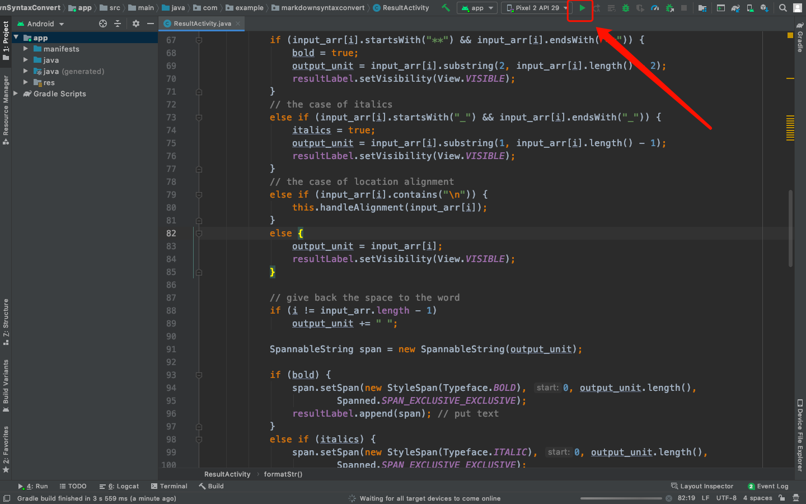
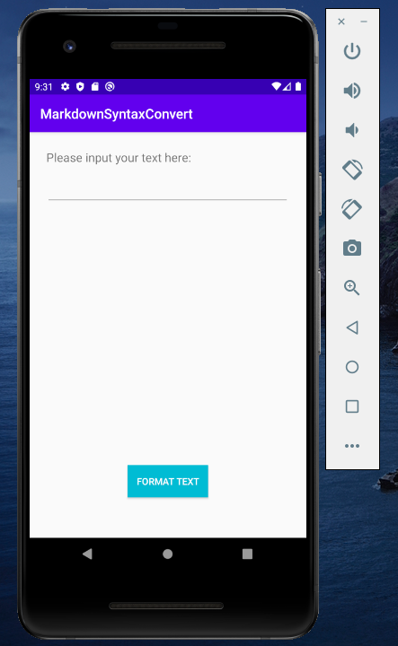
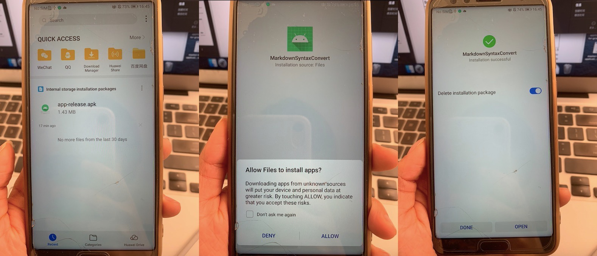
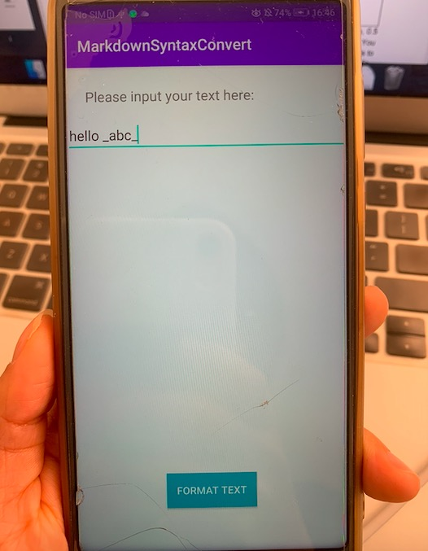

## Install Instructions for Android Application "MarkdownSyntaxConvert"

##### Yuxuan Huang (yuxuanh@kth.se)

Typically, there are two ways to install and run the application to see how it works. First clone and download the project from GitHub: https://github.com/Greathyx/MarkdownSyntaxConvert.git.

#### 1. Run on Android Studio

* Install Android Studio. Please follow the instructions from the official website of Android Studio: https://developer.android.com/studio/install.

* After successfully installing Android Studio, open it and click `Open an existing Android Studio project`, choose the root folder of our project.

* If you have already installed one or more virtual devices on your Android Studio, please select one and run the project by click **Run > Run 'app'** or click the green triangle button on the top menu like the following screenshot:

  

  If you haven't installed any virtual device, please follow the instructions from the official website of Android Studio to install one: https://developer.android.com/studio/run/managing-avds.

  If you successfully run the project, you will get a user interface like this:

  

#### 2. Install on a Phone with Android System

* Transfer `app-release.apk` from `MarkdownSyntaxConvert/app/release/app-release.apk ` to your hardware device and click it to install it. You may need to go through the following steps:

  

* If you successfully install `app-release.apk` and `OPEN` the application, you will get a user interface like this:

  

* Since there are many kinds of phones with Android System, and it seems to be a little different in transfering the `app-release.apk` to differnt kinds of phones, I cannot give very specific instructions. But you can connect your hardware device to your PC and run the project through Android Studio on your hardware device. For more details, please refer to the official website of Android Studio: https://developer.android.com/studio/run/device.

